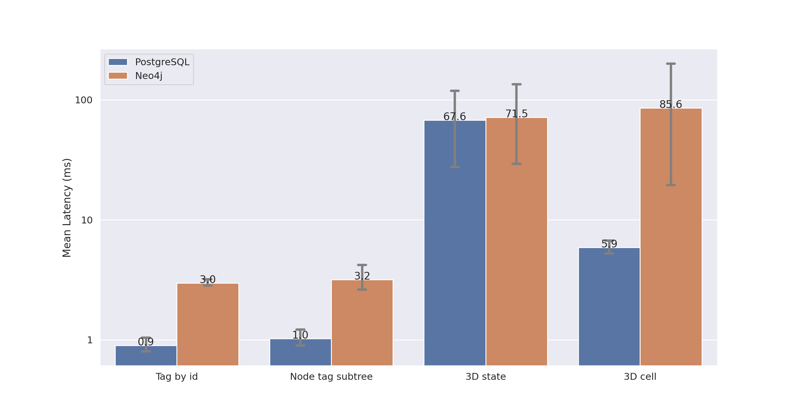
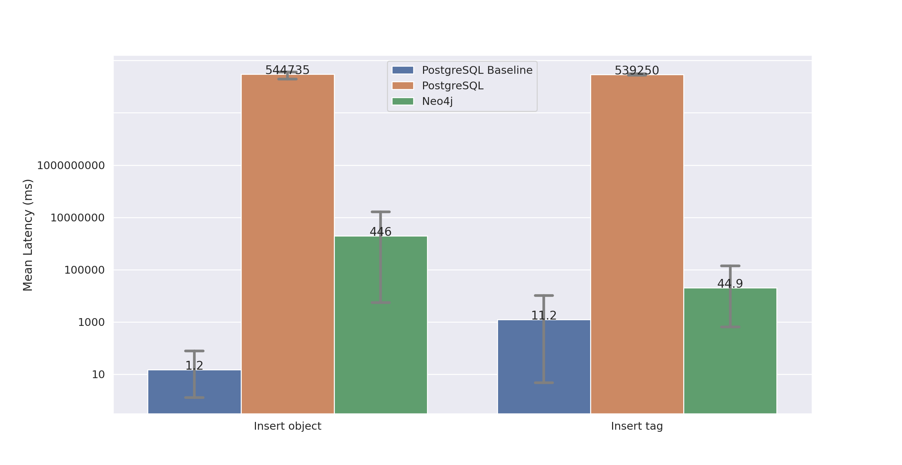

# NeoCube: The Graph-Based Implementation of the M3 Data Model
MSc Thesis | Summer 2022 | MSc Computer Science | IT University of Copenhagen

The M3 model is a data model for media exploration that builds on and combines aspects of multi-dimensional analysis and faceted search to get the best of
both worlds. The data model has previously only been represented as a relational model. This project aims to translate the M3 data model to graph, evaluating it using large-scale datasets. 

The repository current contains the following:
* [Scripts](scripts/) for populating Neo4j graph data model with M3 CSV data.
* Python [benchmarking](benchmarking/) suite with CLI & graph output
* Prototype Node.js GraphQL [server](server/)

## Neo4j
### install
    sudo apt-get install neo4j

### Load NeoCube data
**CSV files needed:**
* cubeobjects.csv
* tags.csv
* alphanumerical_tags.csv
* numerical_tags
* date_tags.csv
* time_tags.csv
* timestamp_tags.csv
* objecttagrelations.csv
* tagsets.csv
* nodes.csv
* hierarchies.csv

1. Place M3 csv data in the neo4j import folder. 

        <neo4j-home>/import
2. Run the [neocube_populate.cypher](scripts/neocube_populate.cypher) script to load the data. This script requires the Neo4j apoc library for timestamp tag name formatting.
   
        cypher-shell -u neo4j -d neo4j -f neocube_populate.cypher

## Neo4j & PostgreSQL Benchmarking suite
Located in the [benchmarking](benchmarking/) directory
### Dependencies
numpy, click, seaborn, neo4j, psycopg, python-dotenv

    pip install -r requirements.txt

### Environment variables
First place .env file in the server folder with the following properties:

    # Neo4j - uses default database (neo4j)
    NEO4J_URL=bolt://localhost:7687
    NEO4J_USER=<username>
    NEO4J_PASSWORD=<password>
    # PostgreSQL
    PSQL_HOST=127.0.0.1
    PSQL_PORT=5432
    PSQL_USER=<username>
    PSQL_PASSWORD=<password>
    PSQL_DB=<database name>
    # LSC dataset 
    MAX_TAG_ID=193189
    MAX_TAGSET_ID=21
    MAX_HIERARCHY_ID=3
    MAX_NODE_ID=8842
    MAX_OBJECT_ID=183386

### Run benchmarks

    python3 M3Benchmarker.py --help

    python3 M3Benchmarker.py complete --r 5

## GraphQL node.js server
https://neo4j.com/product/graphql-library/

Located in the [server](server/) directory.
### Dependencies
@neo4j/graphql @neo4j/graphql-ogm neo4j-driver graphql apollo-server dotenv 

**Install dependencies:**

    npm install

### Environment variables
First place .env file in the server folder with the following properties:

    NEO4J_USER=<username> 
    NEO4J_PASSWORD=<password>
    NEO4J_URI=bolt://localhost:7687
default user and password are neo4j and neo4j.

### Run server
    node index.js

The server can be visited at http://localhost:4000. GraphQL queries can be built here through Apollo Studio. 

## M3 state generators
Navigate to the [generators](generators/) directory and run the following commands:

    python3 postgresql_state_generator_V7.py < 3d.txt
    python3 neo4j_state_generator_V1.py < 3d.txt

## Benchmarking Results

### [VBS](https://videobrowsershowdown.org/call-for-papers/existing-data-and-tools/) dataset

### [LSC](http://lsc.dcu.ie/lsc_data/) dataset

